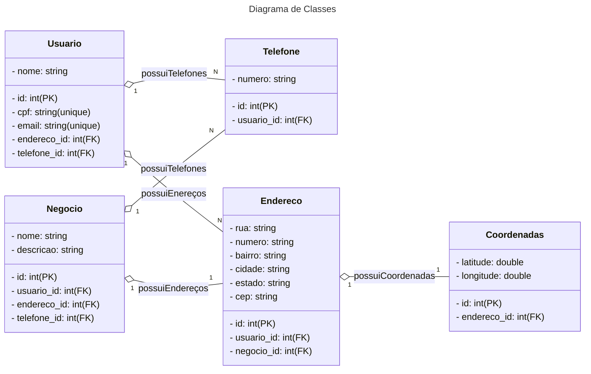

## Projeto do **Santander Bootcamp 2023 - Backend Java

- [API na Nuvem para Usar](https://bsw-2023-api-prd.up.railway.app/swagger-ui.html)

## Diagrama de Classes (Domínio da API)

```mermaid
---
title: Diagrama de Classes
---
classDiagram
  direction LR

  class Negocio {
    - id: int (PK)
    - nome: string
    - descricao: string
    - usuario_id: int (FK)
    - endereco_id: int (FK)
    - telefone_id: int (FK)
  }

  class Telefone {
    - id: int (PK)
    - numero: string
    - usuario_id: int (FK)
  }

  class Usuario {
    - id: int (PK)
    - nome: string
    - cpf: string (unique)
    - email: string (unique)
    - endereco_id: int (FK)
    - telefone_id: int (FK)
  }

  class Endereco {
    - id: int (PK)
    - rua: string
    - numero: string
    - bairro: string
    - cidade: string
    - estado: string
    - cep: string
    - usuario_id: int (FK)
    - negocio_id: int (FK)
  }

  class Coordenadas {
    - id: int (PK)
    - latitude: double
    - longitude: double
    - endereco_id: int (FK)
  }

Usuario "1" o-- "N" Telefone : possuiTelefones
Negocio "1" o-- "N" Telefone : possuiTelefones
Usuario "1" o-- "N" Endereco : possuiEnereços
Negocio "1" o-- "1" Endereco : possuiEndereços
Endereco "1" o-- "1" Coordenadas : possuiCoordenadas
```
